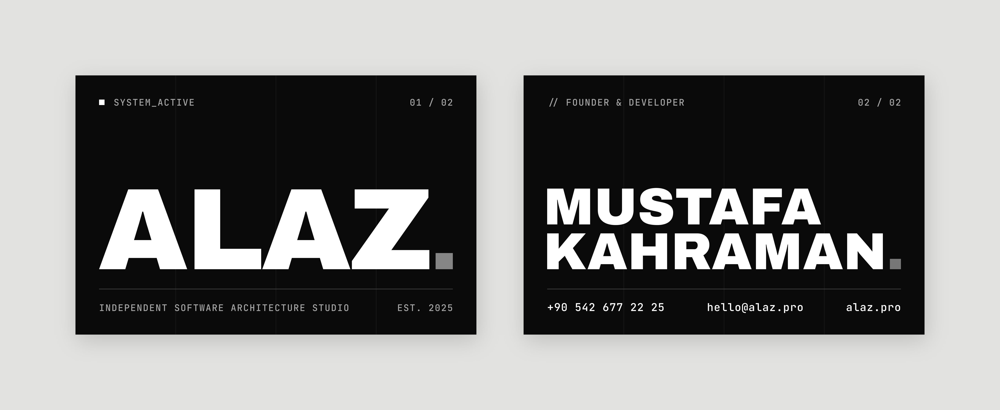

# ALAZ — Kartvizit

Sitenin tasarım diliyle hazırlandı: Archivo Black başlıklar, JetBrains Mono etiketler,
`#0a0a0a` zemin, gri kare noktalı `ALAZ.` logosu, hero bölümündeki 4 kolonlu ince ızgara ve çizgiler.



## Matbaaya gidecek dosyalar

| Dosya | İçerik |
| --- | --- |
| `ALAZ-kartvizit-baski.pdf` | Ön ve arka yüz tek PDF'te (1. sayfa ön, 2. sayfa arka) |
| `ALAZ-kartvizit-on.pdf` | Yalnız ön yüz |
| `ALAZ-kartvizit-arka.pdf` | Yalnız arka yüz |

Matbaa tek dosya isterse `baski.pdf`'i, ön ve arkayı ayrı isterse diğer ikisini gönderin.

## Baskı bilgileri

- **Kesim ölçüsü:** 85 × 55 mm
- **Taşma payı:** her kenarda 3 mm (dosya ölçüsü 91 × 61 mm). PDF'te TrimBox / BleedBox tanımlı.
- **Güvenli alan:** tüm yazılar kesim çizgisinden en az 5 mm içeride.
- **Renk:** CMYK. Zemin zengin siyah `C60 M40 Y40 K100`, beyaz yazılar kağıt beyazı,
  griler yalnız K (`K40`, `K57`, `K65`, `K90`, ızgara çizgileri `K100`).
- **Yazılar:** vektöre (eğriye) çevrildi, PDF'te font yok. Matbaa "fontları outline yapın" derse hazır.
- **Kağıt önerisi:** 350 g mat kuşe, iki yüz mat selefon. İsteğe bağlı: ön yüzdeki `ALAZ.` için lokal lak.

## Düzenleme

`svg/` klasöründeki dosyalar Figma veya Illustrator'da açılabilir (RGB, yazılar vektör).
Tasarım `kaynak/` altındaki Python betikleriyle üretiliyor; isim, unvan veya iletişim bilgisi
değişirse `kaynak/design.py` içindeki `PERSON` alanını düzenleyip yeniden üretin:

```bash
cd brand/kartvizit/kaynak
python3 -m venv .venv && .venv/bin/pip install -r requirements.txt
.venv/bin/python build.py   # fontları Google Fonts'tan indirir, tüm dosyaları yeniden yazar
```
