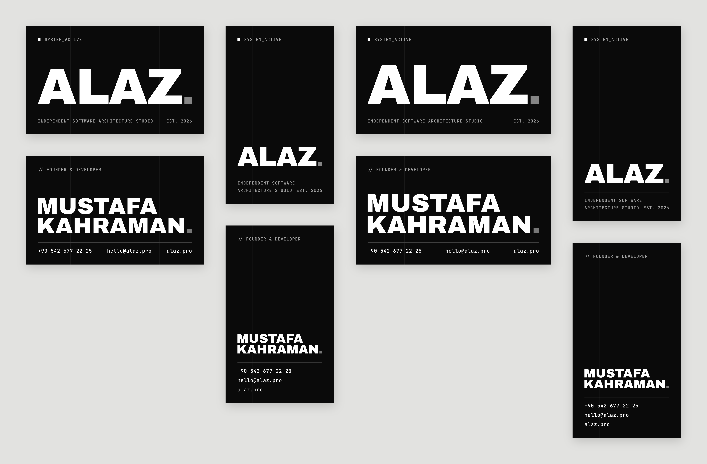

# ALAZ — Kartvizit

Sitenin tasarım diliyle hazırlandı: Archivo Black başlıklar, JetBrains Mono etiketler,
`#0a0a0a` zemin, gri kare noktalı `ALAZ.` logosu, hero bölümündeki 4 kolonlu ince ızgara ve çizgiler.



## Bidolubaskı dosyaları (`bidolubaski/`)

Her ölçü için ön ve arka yüz ayrı PDF:

| Bidolubaskı seçeneği | Ön yüz | Arka yüz | PDF ölçüsü (taşma dahil) |
| --- | --- | --- | --- |
| 8.2x5 cm - Yatay | `ALAZ-kartvizit-8.2x5-yatay-on.pdf` | `ALAZ-kartvizit-8.2x5-yatay-arka.pdf` | 88 × 56 mm |
| 8.2x5 cm - Dikey | `ALAZ-kartvizit-8.2x5-dikey-on.pdf` | `ALAZ-kartvizit-8.2x5-dikey-arka.pdf` | 56 × 88 mm |
| 9x5 cm - Yatay | `ALAZ-kartvizit-9x5-yatay-on.pdf` | `ALAZ-kartvizit-9x5-yatay-arka.pdf` | 96 × 56 mm |
| 9x5 cm - Dikey | `ALAZ-kartvizit-9x5-dikey-on.pdf` | `ALAZ-kartvizit-9x5-dikey-arka.pdf` | 56 × 96 mm |

## Baskı bilgileri

- **Taşma payı:** her kenarda 3 mm (Bidolubaskı 82x50 dikey şablonu: sayfa 56 × 88 mm, kesim 50 × 82 mm).
  PDF'lerde TrimBox / BleedBox tanımlı.
- **Güvenli alan:** tüm yazılar kesim çizgisinden en az 5 mm içeride (şablondaki mavi güvenli alan çizgisi).
- **Renk:** CMYK. Şablonun istediği gibi siyah yalnız `K100`, beyaz yazılar kağıt beyazı,
  griler yalnız K (`K40`, `K57`, `K65`, `K72`, ızgara çizgileri `K88`).
- **Yazılar:** vektöre (eğriye) çevrildi, PDF'lerde font yok.
- **Kağıt önerisi:** 350 g mat kuşe, iki yüz mat selefon. İsteğe bağlı: ön yüzdeki `ALAZ.` için lokal lak.

## Düzenleme

`svg/` klasöründeki dosyalar Figma veya Illustrator'da açılabilir (RGB, yazılar vektör).
Tasarım `kaynak/` altındaki Python betikleriyle üretiliyor; isim, unvan veya iletişim bilgisi
değişirse `kaynak/design.py` içindeki `PERSON` alanını düzenleyip yeniden üretin:

```bash
cd brand/kartvizit/kaynak
python3 -m venv .venv && .venv/bin/pip install -r requirements.txt
.venv/bin/python build.py   # fontları Google Fonts'tan indirir, tüm dosyaları yeniden yazar
```
